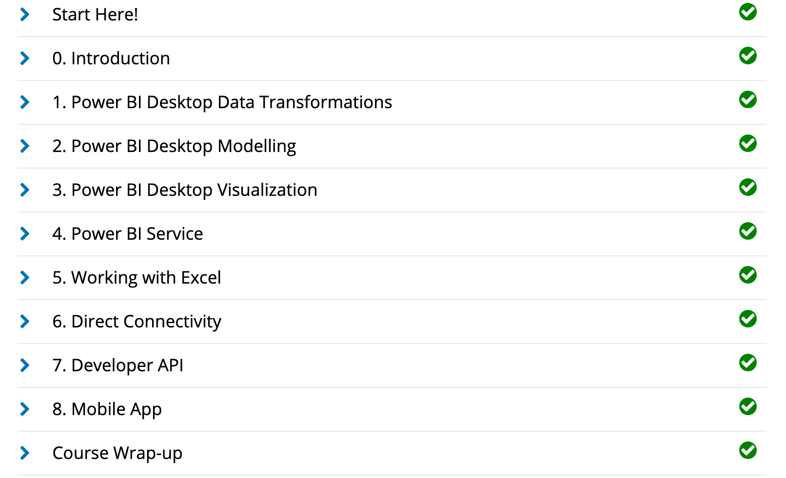
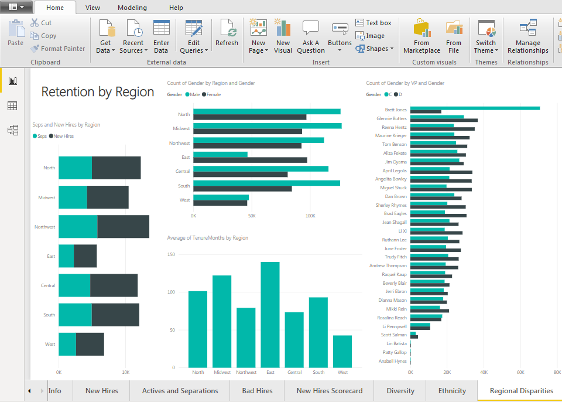

<h1>Steven W. Neal</h1>
<h1>Technical Knowledge, Skills, and Abilities - With Certifications</h1>

Listed below are technical skills I acquired through education, training, and experience in the Computer Information Systems major and Master of Business Administration at The University of Tulsa.

<h2>Technical Skills</h2>

GitHub Learning Lab

 
<ul>
<li>Fundamentals of distributed version control including creating, reviewing and approving pull requests.
<li>An introduction to source code management including task management, bug tracking and documentation.
<li>The use of Markdown and HTML to format webpages in order to display items held in Github repositories.
<li>Review of workflow management including workflow automation through GitHub Apps and workflow security.
  </ul>
I completed the following courses in the <a href="https://lab.github.com/courses">GitHub Learning Lab</a>. These courses taught me how to stand up static pages, create and manage pull requests, facilitate collaboration, and more. 
 
  
<h4>Courses:</h4>
<ul>
<li>First Day on GitHub</li>
<li>First Week on GitHub</li>
<li>Introduction to GitHub</li>
<li>Communicating using Markdown</li>
<li>Introduction to HTML</li>
<li>GitHub Pages</li>
<li>Managing merge conflicts</li>
<li>Community Starter Kit</li>
<li>Uploading your project to GitHub</li>
<li>Getting started with GitHub Apps</li>
<li>Migrating your repository to GitHub</li>
<li>Reviewing pull requests</li>
<li>Securing your workflows</li>
<li>Create a release based workflow</li>
</ul>
 

 
 

Power BI

 
</ul>
<li>Importing datasets, defining data relationships, and editing queries.
<li>Creating dynamic visualizations on customizable reports and dashboards.
<li>Connecting to external data sources such as SQL on Azure and leveraging the capabilites of ESRI ArcGIS and R.
<li>Configuring visualizations to be shared and consumed across multiple platforms.
</ul>

I auditted the <a href="https://www.edx.org/course/analyzing-and-visualizing-data-with-power-bi-0">Analyzing and Visualizing Data with Power BI</a> course on edX and completed the following courses. These courses taught me how to input data, add and modify elements on a dashboard, and transform and interpret different kinds of data. 
 
  
<h4>Courses:</h4> 
<ul>
<li>Power BI Desktop Data Transformations</li>
<li>Power BI Desktop Modelling</li>
<li>Power BI Desktop Visualization</li>
<li>Power BI Service</li>
<li>Working with Excel</li>
<li>Direct Connectivity</li>
<li>Developer API</li>
<li>Mobile App</li>
</ul>
 

 

Power BI Dashboard

 
Using the knowledge I gained from completing the Power BI edX course, I created a dashboard using the <a href="https://docs.microsoft.com/en-us/power-bi/sample-datasets#the-power-bi-samples-as-excel-files">Procurement Analysis sample data</a> provided by Microsoft. Click the following link to watch a demonstration of my Power BI dashboard: <a href="https://youtu.be/q93dXd0959U">Monica May Procurement Analysis Dashboard</a>
 
 

 
 

PowerShell

 
Formatting basic powershell commands for basic system management including an understanding of execution permissions and the powershell help system. Constructing pipelines, variables and arrays to store outputs be used in other commands. Introduction to scripting and process automation for system administration.
   
  
<ul>
<li>Installing Windows Management Framework 5
<li>Running commands (cmdlets)
<li>Discovering commands
<li>Understanding cmdlet syntax
<li>Resolving terse commands
<li>Finding and using local modules
<li>Working with files, printers, CSVs, and XML in the pipeline
<li>Selecting, sorting, and filtering object data
<li>Creating scripts
<li>Automating tasks
<li>Using PowerShell remoting
  </ul>

Using the knowledge I gained from completing the PowerShell course, I created a....  
<a href="https://PLACEHOLDER.HERE">Procurement Analysis sample data</a> provided by Microsoft. 
Click the following link to watch a demonstration of my PowerShell: <a href="https://PLACEHOLDER.HERE">Steve Neal Procurement Analysis Dashboard</a>
 
 

 
 

VPN

 
I configured my own IPSEC VPN in the cloud using the <a href="https://github.com/trailofbits/algo">Algo VPN</a> Ansible scripts provided by Trail of Bits. With the help of this tutorial, I successfully deployed the Algo server, configured the VPN clients, set up an SSH tunnel, and added and removed users. 
 
 
 
 
 

Amazon Web Services (AWS)

 
  <ul>
  <li>Introduction to cloud concepts including exposure to feature sets available on the AWS platform.
<li>The benefits cost savings of moving to a AWS cloud environment with concepts such as: pay-as-you-go and elimination of large up-front capital needs.
<li>AWS’s ability to provide reliable and scalability platforms with built in redundancies to support business continuity efforts.
<li>A review of the shared responsibility model for AWS security.
    </ul>
  
 
I completed the AWS Essentials - NEW course on <a href="https://linuxacademy.com/">Linux Academy</a>. These courses provided me with an introduction to Amazon's Identity Access Management, Elastic Compute Cloud, database services, Simple Notification System, Elastic Load Balancers, Auto Scaling, and Route 53. 
 
 

<h4>Topics:</h4>
<ul>
  <li>AWS Essentials</li>
  <li>Managing AWS Access with Users, Groups, and Roles</li>
  <li>Identity and Access Management (IAM)</li>
  <li>Networking Services and Connectivity</li>
  <li>Virtual Private Cloud (VPC)</li>
  <li>Compute Services</li>
  <li>Elastic Cloud Compute (EC2)</li>
  <li>Storage Services</li>
  <li>Database Services</li>
  <li>Monitoring, Alerts, and Notifications</li>
  <li>Simple Notification Service (SNS)</li>
  <li>Load Balancing, Elasticity, and Scalability</li>
  <li>Elastic Load Balancer (ELB)</li>
  <li>Auto Scaling</li>
  <li>Route 53</li>
  <li>Serverless Computing - Lambda</li>
</ul>
 

 
 

Linux

 
Introduction to the ubuntu Linux distribution including managing file systems, directories, permissions, & basic scripting.
 
I completed the LPI Linux Essentials course on <a href="https://linuxacademy.com/">Linux Academy</a>. These courses gave me an introduction to the Linux operating system and the Linux kernel, as well as the Linux command line syntax. 
 
   

<h4>Topics:</h4>
<ul>
<li>The Linux Community and a Career in Open Source</li>
<li>Linux Evolution and Popular Operating Systems</li>
<li>How to Access a Linux Installation</li>
<li>Major Open Source Applications</li>  
<li>Understanding Open Source Software and Licensing</li> 
<li>ICT Skills and Working in Linux</li>
<li>Command Line Basics</li> 
<li>Using Directories and Listing Files</li> 
<li>Archiving Files on the Command Line</li> 
<li>Searching and Extracting Data from Files</li> 
<li>Turning Commands into a Script</li>
<li>The Linux Operating System</li>
<li>Security and File Permissions</li>
<li>Basic Security and Identifying User Groups</li>
<li>Creating Users and Groups</li> 
<li>Managing File Permissions and Ownership</li> 
<li>Special Directories and Files</li> 
</ul>

<h4> Certificate: </h4>
LPI Linux Essentials Course Completion Certificate:

 

LinkedIn Courses

 
I completed the following courses on <a href="https://www.linkedin.com/learning/">LinkedIn Learning</a>. These courses gave me an introduction to several relevant topics. 
 

<h4>Topics:</h4>
<ul>
<li>Business Analyst and Project Manager Collaboration</li>
<li>Project Management Foundations: Leading Projects</li>
<li>Strategic Thinking</li>
<li>Business Analysis Foundations</li>  
<li>Professional Networking</li> 
<li>Learning Data Analytics</li>
</ul>

<h4> Certificate: </h4>
Course Completion Certificates (Pending):
 

